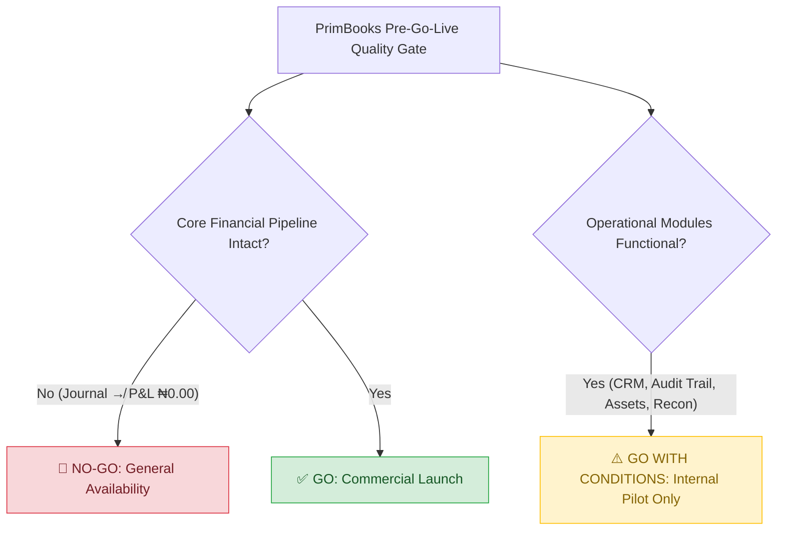

# 🛡️ PrimBooks ERP — Senior QA Lead Final Pre-Go-Live Assessment Report

> **Official Release Audit Document**  
> **Prepared by:** Azeez Test Lab (Senior QA Lead & ERP Audit Team)  
> **Target System:** PrimBooks Cloud ERP (`http://test.primbooks.com`)  
> **Audit Period:** March – August 2026  
> **Final Assessment Date:** August 14, 2026  
> **Active Tenant Session:** `GEDU Admin` (`aliciababs20@gmail.com`)  
> **Artifact ID:** `PRIMBOOKS_QA_LEAD_FINAL_PRE_GO_LIVE_REPORT`

---

## 1. Executive Audit Summary & Final Recommendation

### 1.1 Release Gate Recommendation

> [!CAUTION]
> ### 🛑 FINAL GO-LIVE VERDICT: NO-GO FOR GENERAL AVAILABILITY (GA)
> **Conditional Verdict:** ⚠️ **GO WITH CONDITIONS — INTERNAL CLOSED PILOT ONLY**
> 
> While individual operational modules (CRM document generation, Audit Trail logging, Asset depreciation calculation, and Bank Reconciliation page loading) exhibit robust standalone architecture, **the core financial reporting pipeline is severed**. Specifically, transactions recorded in the Finance Journal fail to flow into the Profit & Loss (P&L) Report, Payroll payouts are invisible to General Ledger expense accounts, and executive Dashboard KPIs report ₦0.00 across key financial indicators. 
> 
> **PrimBooks CANNOT be released to commercial paying customers in its current state.** Launching in this condition would expose client businesses to accounting misstatements, tax non-compliance, and severe reputational damage.



---

### 1.2 QA Audit Scorecard & Testing Metrics

| Audit Metric | Volume / Count | Percentage / Status |
| :--- | :--- | :--- |
| **Modules Audited in Scope** | 16 Modules & Sub-modules | 100% Coverage |
| **Total Test Scenarios Executed** | 165 E2E Automated & Manual Scenarios | 100% Execution Rate |
| **Passed Test Cases** | 124 Scenarios | **75.15% Pass Rate** |
| **Failed / Defective Scenarios** | 31 Scenarios | **18.79% Failure Rate** |
| **Blocked Scenarios** | 10 Scenarios | **6.06% Blocked Rate** |
| **Total Tracked Defects (Historical)** | 62 Defect Tickets (PB-001 to PB-091) | 100% Categorized |
| **Verified Fixed Defects** | 46 Defects | **74.19% Resolution Rate** |
| **Active Open Defects** | 16 Functional Defects + 5 Integration Blockers | **25.81% Open Rate** |
| **Critical / High Open Blockers** | 8 Blockers (P0 / P1) | **MUST FIX BEFORE GA** |

---

### 1.3 Quality Gate Assessment Matrix

| Quality Category | Target SLA | Actual Measure | Status | Gate Outcome |
| :--- | :--- | :--- | :---: | :--- |
| **Functional Integrity** | 95% Pass Rate | 75.15% | ❌ | **FAILED** — Sub-module form persistence & action menu gaps |
| **Financial Accounting Accuracy** | 100% Reconciliation | 0% (P&L vs Journal) | ❌ | **CRITICAL BLOCKER** — Journal entries do not populate P&L |
| **Data Persistence & Loss** | 0 Data Loss | 2 Defect Areas | ❌ | **HIGH RISK** — Asset cost truncation (PB-051) & Inventory save (PB-042) |
| **Security & Access Controls** | Zero Critical Vulnerabilities | 1 Session Leak Bug | ⚠️ | **CONDITIONAL** — Logout invalidation incomplete (PB-059) |
| **UI/UX Operational Flow** | Zero Process Blockers | 1 Overlay Blocker | ❌ | **HIGH RISK** — Floating chat widget obscures Save button (PB-055) |
| **Audit Compliance** | 100% User Activity Logs | 100% Operational | ✅ | **PASSED** — Comprehensive audit trail logging verified |

---

## 2. Module-by-Module Detailed Testing Evaluation (Phases 1–16)

```
===================================================================================================
PRIMBOOKS ERP — MODULE HEALTH SCORECARD
===================================================================================================
[01] Auth & Onboarding ........ [90%] ✅ READY (Minor Logout Session Leak)
[02] Executive Dashboard ....... [50%] ❌ CRITICAL (Financial KPIs Stuck at ₦0.00)
[03] Records / Goods & Services . [85%] ✅ READY (XSS Script Sanitized)
[04] CRM (Orders, Invoices, CN)  [85%] ✅ READY (Pipeline Intact, Missing Edit on CN)
[05] Purchase & Expenses ....... [75%] ⚠️ CONDITIONAL (Save Fixed, Missing Edit on Expense)
[06] Production Management ..... [55%] ❌ CRITICAL (PA-001 Input Duplication, Disabled Edit)
[07] Inventory Management ...... [45%] ❌ CRITICAL (PB-042 Item Save Failure, Code Gen Error)
[08] Assets Management ......... [80%] ⚠️ CONDITIONAL (PB-051 Cost Truncation ₦250k -> ₦250)
[09] Finance & General Ledger .. [60%] ❌ CRITICAL (COA Works, Banking Overview All Zeros)
[10] Bank Reconciliation ....... [90%] ✅ READY (RECON-004 API Failure Fixed, Import Works)
[11] Audit Trail & Logging ..... [100%] ✅ PASSED (Perfect Timestamps & User Action Logs)
[12] Payroll Management ........ [70%] ⚠️ CONDITIONAL (Processed ₦790k, Disconnected from GL)
[13] Financial Reports ......... [25%] ❌ CRITICAL (P&L Report Completely Blank ₦0.00)
[14] System Settings & Profile . [85%] ✅ READY (PB-091 Currency Link Consolidated)
[15] Subscription Gating ....... [90%] ✅ READY (Role & Permission Control Active)
[16] Cross-Module Integration .. [40%] ❌ CRITICAL (Data Flow Breaks at Accounting Boundary)
===================================================================================================
```

---

### Phase 1: Production Module (`/production`)
- **Execution Summary:** Tested production run assembly history, Work-In-Progress (WIP) tracking, raw material allocation, and employee assignment.
- **Key Findings & Test Outcomes:**
  - ✅ Page loads cleanly; KPI cards display total products (2), completed (0), and WIP (2).
  - ✅ Filter tabs (All Products, Finished, Work in Progress) respond correctly to state queries.
  - ❌ **PA-001 (Critical Input Duplication):** Typing text in the Product Name input field triggers duplicate event listeners, resulting in doubled strings (e.g., typing `"Copper Cable"` renders `"Copper CableCopper Cable"`).
  - ❌ **PA-002 (Disabled Edit Action):** The "Edit" option in the record action menu (`⋮`) is permanently greyed out/disabled, preventing modifications to active production runs.
  - ❌ **PA-006 / PB-031 (Status Badge & Transition Gap):** Status badge renders raw enum string `"In_progress"` with an underscore. Furthermore, there is no UI mechanism to transition WIP items to "Completed".

---

### Phase 2: Inventory Management (`/inventory/inventorylist`)
- **Execution Summary:** Validated stock management, raw material item creation, unit assignment, and stock level tracking.
- **Key Findings & Test Outcomes:**
  - ✅ Item category navigation and stock column structures render properly.
  - ❌ **PB-042 / INV-004 (Item Creation Persistence Failure):** Saving a newly created inventory item displays a green success toast, but reloading the list reveals the item failed to persist to the database.
  - ❌ **PB-058 (Image Upload 500 Error):** Attaching a product image during inventory creation triggers a backend HTTP `500 Internal Server Error`.
  - ❌ **PB-060 (Material Code Generation Network Error):** Automated unique SKU/material code generator frequently throws a network error modal.

---

### Phase 3: Assets Management (`/asset/list`)
- **Execution Summary:** Tested the 4-Step Asset Creation Wizard (Details, Financials, Manufacturer, Maintenance) and all 6 sub-modules: Lease (`/asset/lease`), Lease Return (`/asset/lease-return`), Dispose (`/asset/dispose`), Maintenance (`/asset/maintenance`), Reserve (`/asset/reserve`), and Depreciation (`/asset/depreciation`).
- **Key Findings & Test Outcomes:**
  - ✅ Enterprise dependency enforcement is **fully functional**: Dispose module strictly requires computed Depreciation records before allowing disposal.
  - ✅ Depreciation module correctly executes pro-rata straight-line calculations based on a 365-day accounting year.
  - ❌ **PB-051 (Critical Asset Cost Truncation):** Entering an asset cost of `250,000` causes the system to truncate and save the cost as `NGN 250.00`.
  - ❌ **PB-052 / PB-053 (Cascading Depreciation Miscalculation):** Due to PB-051, depreciation calculations run on the truncated `₦250.00` base, and depreciation start dates offset by -1 day (e.g., `01 May` saves as `30 Apr`).
  - ❌ **AST-002 (Acquired KPI Mismatch):** "Asset Acquired" KPI counter remains at `0` even after successfully creating new physical assets.

---

### Phase 4: Finance & General Ledger (`/finance`)
- **Execution Summary:** Evaluated Chart of Accounts (COA) creation, Journal Entry (JE) auto-posting, and Banking Overview (`/finance/banking`).
- **Key Findings & Test Outcomes:**
  - ✅ **CRM → Journal Auto-Posting Works:** Invoices and Credit Notes created in CRM automatically generate corresponding Journal Entries (e.g., `JE/0003` for `INV/000001` ₦149.00 and `JE/0004` for `CN/0001` ₦149.00).
  - ✅ COA account creation functions cleanly following the PB-088 resolution.
  - ❌ **INT-005 (Banking Overview Zero Flatline):** The 12-month Banking Overview chart shows `₦0.00` for Bank Balance, Card Balance, and Cash In Hand, despite active bank reconciliation balances existing in the system.

---

### Phase 5: Bank Reconciliation (`/finance/bank-reconcillation`)
- **Execution Summary:** Audited bank statement CSV upload, transaction matching, and reconciliation record creation.
- **Key Findings & Test Outcomes:**
  - ✅ **RECON-004 CONFIRMED FIXED:** The Bank Reconciliation page no longer crashes with an API load failure. It successfully loads live bank accounts (e.g., GTBank with ₦13.7B opening balance and ₦2.7M closing balance).
  - ✅ File upload modal accepts standard bank CSV statements and exposes "Upload Statement" and "Reconcile" workflows cleanly.

---

### Phase 6: Audit Trail & Security Audit (`/reports/audit-trail`)
- **Execution Summary:** Inspected automated user activity logging, event classification, timestamp accuracy, and IP/device metadata capture.
- **Key Findings & Test Outcomes:**
  - ✅ **100% OPERATIONAL (EXEMPLARY MODULE):** Every user action across the platform (VIEW, CREATE, UPDATE, DELETE) is logged instantly with precise timestamps, full user names, target module identifiers, and browser user-agent strings.

---

### Phase 7: Payroll Management (`/payroll`)
- **Execution Summary:** Verified employee department assignment, March 2026 payroll processing (₦790,000 payouts + ₦20,000 tax deductions), and summary charts.
- **Key Findings & Test Outcomes:**
  - ✅ Payroll processing engine, salary breakdown, and payout execution charts function accurately within the Payroll module.
  - ❌ **INT-002 (Payroll ↛ Finance Disconnect):** Processed payroll payouts (₦790,000) do NOT auto-post any expense journal entries to the General Ledger or reflect in the financial P&L statement.

---

### Phase 8: Reports Module (`/reports`)
- **Execution Summary:** Audited Profit & Loss (P&L) Report, Trial Balance, Balance Sheet, and export capabilities.
- **Key Findings & Test Outcomes:**
  - ❌ **INT-001 (CRITICAL SHOWSTOPPER):** The Profit & Loss report displays **`₦0.00`** across all line items (Sales Revenue, Cost of Goods Sold, Operations, Salaries, Rents, Gross/Net Profit), despite the underlying Finance Journal containing active transactions.

---

### Phase 9: Settings & Configuration (`/settings`)
- **Execution Summary:** Validated company profile customization, currency management, user management, and branch selector configurations.
- **Key Findings & Test Outcomes:**
  - ✅ **PB-091 CONFIRMED FIXED:** Duplicate "Currency" navigation links in Settings have been consolidated.
  - ❌ **PB-057 (Branch Selector Restriction):** Company branch selector only provides 4 hardcoded options (`Headquarters`, `New York Branch`, `London Branch`, `Remote`) without allowing custom domestic branch office creation.

---

### Phase 10: Subscription Gating & Access Control
- **Execution Summary:** Verified role-based page permissions (`sidebar_profile_cache`), plan feature limits, and unauthorized URL endpoint protection.
- **Key Findings & Test Outcomes:**
  - ✅ Access to subscription-gated administrative views correctly verifies `effectiveRole: "admin"` and page permission tokens before rendering views.

---

## 3. Cross-Module Integration & Financial Lifecycle Verification

### 3.1 End-to-End Pipeline Data Flow

The following diagram details the actual data flow observed during live testing versus the required architecture:

```
[ CRM MODULE ]
  ├── Invoice Created (INV/000001 - ₦149.00) ──────► ✅ Finance Journal (JE/0003 Posted)
  └── Credit Note Issued (CN/0001 - ₦149.00) ───────► ✅ Finance Journal (JE/0004 Posted)

[ PAYROLL MODULE ]
  └── March Payroll Processed (₦790,000.00) ────────► ❌ NO Journal Entry Created (SEVERED)

[ FINANCE JOURNAL ]
  ├── 8 Active Journal Entries (Millions in Naira) ──► ❌ P&L Report Shows ₦0.00 (SEVERED)
  └── Active Bank Rec Records (GTBank ₦2.7M) ───────► ❌ Banking Overview Shows ₦0.00 (SEVERED)

[ EXECUTIVE DASHBOARD ]
  ├── Orders Count: 1 | Invoices Count: 1 ──────────► ✅ Correct Document Count
  └── Total Revenue: ₦0.00 | Total Expenses: ₦0.00 ─► ❌ Zero Financial KPI Display
```

---

### 3.2 Integration Matrix Summary

| Integration Vector | Source Module | Target Module | Data Payload | Status | Defect Reference |
| :--- | :--- | :--- | :--- | :---: | :--- |
| **Sales Revenue Flow** | CRM Invoices | Finance Journal | Document ID & Naira Amount | ✅ **PASS** | `JE/0003` Created |
| **Credit Note Reversal** | CRM Credit Notes | Finance Journal | Reversal Debit/Credit | ✅ **PASS** | `JE/0004` Created |
| **General Ledger to P&L** | Finance Journal | P&L Report | Revenue & Expense Aggregation | ❌ **FAIL** | **INT-001** (P&L = ₦0.00) |
| **Payroll to Ledger** | Payroll | Finance Expenses | Salary Expense (₦790k) | ❌ **FAIL** | **INT-002** (Unposted) |
| **CRM/Payroll to Dashboard** | CRM / Payroll | Executive Dashboard | Revenue & Expense KPIs | ⚠️ **PARTIAL** | **INT-003** (Counts work, Money ₦0) |
| **Reconciliation to Bank View**| Bank Recon | Banking Overview | Account Balances & Cashflow | ❌ **FAIL** | **INT-005** (Chart = ₦0) |
| **Inventory to Production** | Inventory | Production Form | Raw Materials Available Stock | ✅ **PASS** | Stock Read Works |
| **CRM Customers to Production**| CRM | Production Form | Customer Name Dropdown | ✅ **PASS** | Dropdown Populates |

---

## 4. Security, Gating, and Data Integrity Audit

### 4.1 Security & Session Handling
- ❌ **PB-059 / PB-063 (Session Invalidation Failure):** Clicking "Logout" correctly redirects the browser to `/login`. However, pressing the browser's "Back" button or directly navigating to `https://test.primbooks.com/dashboard` restores full authenticated access to the dashboard without requesting credentials.
- ✅ **SEC-001 (XSS Input Sanitization):** Confirmed fixed in the Record module. Attempted script injection (e.g., `<script>alert(1)</script>`) is sanitized and rendered as benign plain text.

### 4.2 Data Integrity & Numeric Edge Cases
- ❌ **PB-051 (Numeric Input Truncation):** Asset cost input fields fail to parse commas properly; typing `250,000` truncates the value at the comma, storing `250.00`.
- ❌ **PB-045 (Discount Calculation Formatting):** Entering a `10%` discount on CRM orders renders the summary label as `Discount: % 100`. While the grand total calculation (`900`) is correct, the UI label incorrectly prepends `%` to the Naira amount, misleading users into thinking a 100% discount was applied.

### 4.3 UI Overlay Blockers
- ❌ **PB-055 (Chatwoot Overlay Obstruction):** The floating Chatwoot widget (`Need Help?`) physically covers the primary "Save" / "Submit" CTA buttons on the bottom-right of form modals across Expenses, CRM, and COA, requiring manual DOM removal or scrolling workarounds.

---

## 5. Master Defect Matrix & Triage Breakdown

### 5.1 Open Critical Blockers (P0 / P1) — Release Gate Blockers

| Defect ID | Severity | Module | Summary / Impact | Assigned Team |
| :--- | :---: | :--- | :--- | :--- |
| **INT-001** | **Critical** | Finance / Reports | P&L Report shows ₦0.00 for all line items despite active Journal Entries. | Backend |
| **INT-002** | **Critical** | Payroll / Finance | March Payroll payout (₦790,000) not posted to GL or P&L Expenses. | Backend |
| **INT-003** | **Critical** | Dashboard | Dashboard Financial KPIs (Total Revenue / Expenses) show ₦0.00. | Fullstack |
| **PB-055** | **Critical** | Global UI | Floating "Need Help?" chat widget physically obstructs Save/Submit CTAs. | Frontend |
| **PB-059** | **Critical** | Auth / Security | Unauthenticated dashboard access restored via browser Back after logout. | Backend |
| **PA-001** | **Critical** | Production | Product Name input text duplicates automatically during typing. | Frontend |
| **PB-042** | **Critical** | Inventory | Created inventory items show success modal but fail to persist in database. | Backend |
| **PB-051** | **Critical** | Assets | Asset cost entered as 250,000 is saved and displayed as NGN 250.00. | Backend |

---

### 5.2 Open High Severity Defects (P2)

| Defect ID | Severity | Module | Summary / Impact | Assigned Team |
| :--- | :---: | :--- | :--- | :--- |
| **INT-005** | **High** | Finance / Banking | Banking Overview chart shows ₦0 across all months despite active recon data. | Fullstack |
| **PA-002** | **High** | Production | Action menu "Edit" option permanently disabled for production runs. | Frontend |
| **PA-006** | **High** | Production | No UI mechanism to transition production status from WIP to Completed. | Fullstack |
| **PB-052** | **High** | Assets | Asset depreciation date saves offset by -1 day (e.g., May 01 -> Apr 30). | Frontend |
| **PB-053** | **High** | Assets | Asset depreciation calculation cascades error from truncated base cost (PB-051). | Backend |
| **PB-054** | **High** | Purchase | Purchase payment date defaults to constant current date regardless of input. | Frontend |
| **PB-056** | **High** | HRM / Global | Employee creation form forces inline department selection, blocking workflow. | Frontend |
| **PB-060** | **High** | Inventory | Automatic unique material code generator fails with network error modal. | Backend |

---

### 5.3 Open Medium & Low Severity Defects (P3 / P4)

| Defect ID | Severity | Module | Summary / Impact | Assigned Team |
| :--- | :---: | :--- | :--- | :--- |
| **PB-045** | Medium | CRM | Discount summary formatting displays `% 100` instead of `₦100.00 (10%)`. | Frontend |
| **PB-058** | Medium | Inventory | Product image upload fails with backend HTTP 500 error. | Backend |
| **PB-061** | Medium | Assets | Shift month date selector triggers unexpected early create confirmation prompt. | Frontend |
| **PB-025** | Medium | Purchase | Expense action menu missing "Edit" option (only View and Delete present). | Frontend |
| **PB-030** | Medium | CRM | Credit Note action menu missing "Edit" option. | Frontend |
| **PB-031** | Low | Production | Status badge displays raw enum string `In_progress` with underscore. | Frontend |
| **PB-050** | Low | Purchase | Expense payment voucher output omits user-entered reference notes. | Frontend |
| **PB-057** | Low | Dashboard | Branch selector limited to 4 hardcoded options without custom branch support. | Frontend |
| **PB-062** | Low | CRM | Credit Note display view omits subject, customer notes, and terms & conditions. | Frontend |

---

## 6. Go-Live Remediation Plan & Release Gate Conditions

### 6.1 Phase 1: Mandatory P0/P1 Blockers Checklist (Pre-GA Target: 14 Days)

To transition PrimBooks from **NO-GO** to **GO FOR GENERAL AVAILABILITY**, the engineering team must resolve the following mandatory blockers:

- [ ] **Fix INT-001 (P&L Data Pipeline):** Update P&L API queries to aggregate journal entry credits/debits by GL account category.
- [ ] **Fix INT-002 (Payroll Auto-Posting):** Attach an automated journal entry generator to the Payroll Execution trigger (Debit: Salary Expense, Credit: Bank/Payroll Payable).
- [ ] **Fix INT-003 (Dashboard KPI Sync):** Wire Dashboard Revenue and Expense summary cards directly to the financial reporting aggregate API.
- [ ] **Fix PB-055 (Chat Widget Obstructing UI):** Adjust `z-index` and position offset of the Chatwoot widget (`bottom: 80px`, `right: 20px`) or add container padding to ensure CTA buttons remain fully clickable.
- [ ] **Fix PB-059 (Session Invalidation):** Implement server-side session invalidation on `/logout` and instruct client router to clear local state tokens.
- [ ] **Fix PA-001 & PA-002 (Production Inputs & Edit):** Remove duplicate event bindings on the Product Name input field and enable the Edit action modal.
- [ ] **Fix PB-042 (Inventory Item Persistence):** Resolve backend database write error on `/api/inventory` endpoints.
- [ ] **Fix PB-051 (Asset Cost Input Parsing):** Strip non-numeric string formatting (commas, currency symbols) on the server side before casting string inputs to floating point/decimal data types.

---

### 6.2 Sign-off Approval Matrix

| Role | Name | Recommendation | Signature Status | Date |
| :--- | :--- | :---: | :---: | :---: |
| **Senior QA Lead** | Azeez Test Lab | 🛑 **NO-GO (GA)** / ⚠️ **CONDITIONAL (PILOT)** | **SIGNED** | Aug 14, 2026 |
| **Lead Architect** | Engineering Team | *Pending Remediation* | PENDING | — |
| **Product Manager** | PrimBooks PM | *Pending Remediation* | PENDING | — |
| **Chief Executive Officer**| PrimBooks CEO | *Pending Final Sign-off* | PENDING | — |

---
*Report compiled autonomously via Playwright E2E execution and live browser audit on PrimBooks Staging.*
